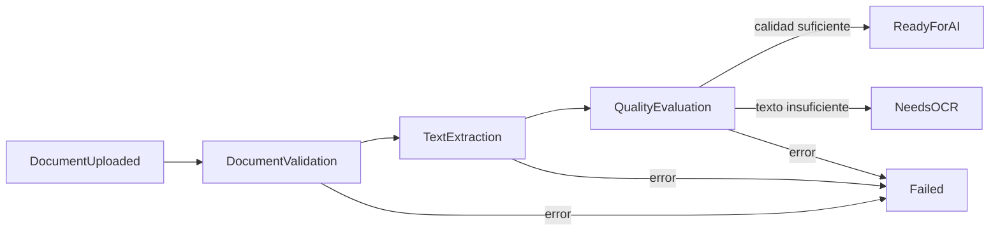

# SmartQuote AI

Backend para administrar licitaciones, almacenar documentos privados y extraer texto de PDFs mediante un pipeline asíncrono auditable.

## Alcance actual

La Iteración 5 agrega:

- Celery como motor de tareas;
- Redis como broker y backend de resultados;
- detección periódica de documentos pendientes;
- extracción de texto por página;
- PyMuPDF como extractor primario;
- pdfplumber como fallback automático;
- evaluación de calidad documental;
- estados `queued`, `processing`, `text_extracted`, `ready_for_ai`, `needs_ocr` y `failed`;
- persistencia de páginas, ejecuciones, configuración, errores y métricas;
- endpoints de consulta para estado, páginas, calidad y extracción;
- logs estructurados en JSON.

Fuera de alcance: OpenAI, OCR, extracción de productos, proveedores, RFQs y procesamiento síncrono.

## Servicios

```bash
docker compose up --build
```

El entorno inicia:

| Servicio | Función |
|---|---|
| `api` | FastAPI y carga de documentos |
| `worker` | ejecución de etapas Celery |
| `beat` | detección periódica de documentos pendientes |
| `redis` | broker y backend Celery |
| `postgres` | metadatos, páginas, métricas y auditoría |

Aplicar migraciones:

```bash
docker compose run --rm api uv run alembic upgrade head
```

Swagger: `http://localhost:8000/docs`

## Pipeline documental



Las etapas se implementan como tareas Celery independientes:

- `smartquote.documents.validate`
- `smartquote.documents.extract_text`
- `smartquote.documents.evaluate_quality`
- `smartquote.documents.finalize`

La carga publica `smartquote.documents.start_pipeline`. El worker orquesta las etapas sin ejecutarlas en el proceso HTTP. Cada etapa también está registrada como tarea Celery independiente. Celery Beat ejecuta `smartquote.documents.detect_pending` para recuperar documentos `uploaded` o `queued` que no hayan sido consumidos.

## Flujo completo

1. `POST /api/v1/tenders/{id}/documents` valida y almacena el PDF privado.
2. Se registra `DocumentUploaded`.
3. El documento cambia de `uploaded` a `queued` y se registra `DocumentQueued`.
4. Después del commit SQL se publica la tarea en Redis.
5. El worker valida nuevamente firma y SHA-256 del archivo almacenado.
6. El documento pasa a `processing`.
7. PyMuPDF extrae texto página por página mediante `Page.get_text("text", sort=True)`.
8. Si falla o la extracción es insuficiente, se ejecuta pdfplumber.
9. Se persisten `ExtractionRun` y cada `DocumentPage`.
10. El documento pasa a `text_extracted`.
11. `DocumentQualityEvaluator` calcula métricas.
12. El documento termina en `ready_for_ai` o `needs_ocr`.
13. Los errores dejan evidencia en `ExtractionRun` y cambian el documento a `failed`.

## Persistencia

### `extraction_runs`

Conserva:

- extractor final y versión;
- configuración canónica;
- clave de idempotencia;
- inicio, final y duración;
- páginas y caracteres extraídos;
- resultado y errores;
- referencia a ejecución reutilizada cuando aplique.

### `document_pages`

Cada página conserva:

- número;
- texto;
- dimensiones;
- caracteres y palabras;
- indicador de página vacía;
- densidad aproximada;
- duración de extracción.

### `document_qualities`

Conserva:

- páginas procesadas y vacías;
- porcentaje de páginas sin texto;
- caracteres extraídos;
- densidad agregada;
- calidad estimada;
- decisión;
- indicador de revisión manual.

## Extractores

`DocumentTextExtractor` desacopla Application de las bibliotecas PDF.

```text
DocumentTextExtractor
├── PyMuPDFExtractor       # primario
└── PdfPlumberExtractor    # fallback
```

La estrategia intenta pdfplumber cuando PyMuPDF:

- produce una excepción;
- no alcanza el mínimo de caracteres;
- supera el porcentaje permitido de páginas vacías;
- no alcanza el promedio mínimo de caracteres por página.

Si ambos resultados existen, se conserva el de mayor cantidad de texto, menor porcentaje vacío y mayor cantidad de páginas.

## Evaluación de calidad

La densidad se calcula como caracteres extraídos entre el área total de las páginas en pulgadas cuadradas.

Decisiones:

- `ready_for_ai`: texto suficiente, pocas páginas vacías y densidad mínima;
- `needs_ocr`: documento vacío o con texto extremadamente escaso;
- `manual_review`: calidad intermedia; se conserva en `DocumentQuality` y el estado operativo se marca `needs_ocr` porque OCR/revisión serán resueltos en una iteración posterior.

Todos los umbrales son configurables mediante variables `SMARTQUOTE_QUALITY_*`.

## Idempotencia

La clave SHA-256 de procesamiento incluye:

- hash SHA-256 del PDF;
- nombre y versión de PyMuPDF;
- nombre y versión de pdfplumber;
- política de fallback;
- configuración de calidad/extracción aplicable.

Una ejecución completada con la misma clave se reutiliza. La restricción única `(document_id, processing_key)` evita ejecuciones válidas duplicadas.

## Endpoints de documentos

| Método | Ruta | Resultado |
|---|---|---|
| `POST` | `/api/v1/tenders/{id}/documents` | Carga PDFs y dispara el pipeline |
| `GET` | `/api/v1/documents/{id}/status` | Estado y fechas del procesamiento |
| `GET` | `/api/v1/documents/{id}/pages` | Texto y métricas por página |
| `GET` | `/api/v1/documents/{id}/quality` | Evaluación de calidad |
| `GET` | `/api/v1/documents/{id}/extraction` | Evidencia de la ejecución |
| `GET` | `/api/v1/documents/{id}/download` | Descarga privada |
| `DELETE` | `/api/v1/documents/{id}` | Eliminación lógica |

No existe endpoint HTTP para iniciar manualmente el pipeline.

## Ejemplo

```bash
curl -X POST http://localhost:8000/api/v1/tenders/TENDER_ID/documents \
  -F 'uploaded_by_user_id=00000000-0000-0000-0000-000000000001' \
  -F 'files=@bases.pdf;type=application/pdf'

curl http://localhost:8000/api/v1/documents/DOCUMENT_ID/status
curl http://localhost:8000/api/v1/documents/DOCUMENT_ID/pages
curl http://localhost:8000/api/v1/documents/DOCUMENT_ID/quality
curl http://localhost:8000/api/v1/documents/DOCUMENT_ID/extraction
```

## Configuración relevante

```text
SMARTQUOTE_CELERY_BROKER_URL=redis://redis:6379/0
SMARTQUOTE_CELERY_RESULT_BACKEND=redis://redis:6379/1
SMARTQUOTE_PENDING_DOCUMENT_SCAN_SECONDS=60
SMARTQUOTE_EXTRACTION_MINIMUM_CHARACTERS=100
SMARTQUOTE_EXTRACTION_MAXIMUM_EMPTY_PAGE_PERCENTAGE=60
SMARTQUOTE_QUALITY_READY_MINIMUM_CHARACTERS=200
SMARTQUOTE_QUALITY_READY_MAXIMUM_EMPTY_PAGE_PERCENTAGE=25
SMARTQUOTE_QUALITY_READY_MINIMUM_DENSITY=1.5
SMARTQUOTE_QUALITY_OCR_MAXIMUM_CHARACTERS=50
SMARTQUOTE_QUALITY_OCR_MINIMUM_EMPTY_PAGE_PERCENTAGE=50
SMARTQUOTE_QUALITY_OCR_MAXIMUM_DENSITY=0.5
```

## Pruebas

```bash
cd backend
uv sync
uv run alembic upgrade head
uv run pytest
uv run ruff check .
uv run python -m compileall app tests alembic
```

La suite incluye PDFs reales pequeños en `tests/fixtures/` y pruebas de:

- extractores;
- fallback;
- métricas;
- estados;
- pipeline completo;
- persistencia de páginas;
- idempotencia;
- endpoints;
- worker Celery con Redis real.

## Documentación técnica

- `docs/iteration-4-document-management.md`
- `docs/iteration-5-text-extraction-pipeline.md`
- `docs/continuous-integration.md`
