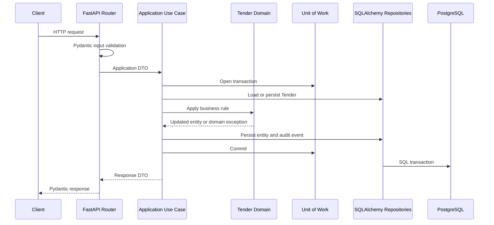

# SmartQuote AI

Sistema para automatizar el proceso de cotizaciones y licitaciones siguiendo Clean Architecture.

## Iteración 3: Tender Management

Esta iteración implementa exclusivamente el primer flujo completo de negocio: creación y administración de licitaciones mediante una API REST.

No incluye carga de documentos, procesamiento de archivos, extracción de PDFs ni funciones de inteligencia artificial.

## Requisitos

- Python 3.12
- uv
- Docker
- Docker Compose
- PostgreSQL 16

## Instalación

```bash
cp .env.example .env
cd backend
uv sync
```

Levantar PostgreSQL:

```bash
docker compose up -d postgres
```

Aplicar migraciones:

```bash
cd backend
uv run alembic upgrade head
```

Ejecutar la API:

```bash
uv run uvicorn app.main:app --reload
```

Servicios:

- API: `http://localhost:8000`
- OpenAPI: `http://localhost:8000/docs`
- ReDoc: `http://localhost:8000/redoc`
- Health check: `http://localhost:8000/health`

## Usuario técnico inicial

La migración de la Iteración 3 registra un usuario técnico para poder probar el módulo antes de implementar autenticación y administración de usuarios:

```text
ID: 00000000-0000-0000-0000-000000000001
Email: system@smartquote.local
```

El campo `created_by_user_id` debe apuntar a un usuario existente. Esta validación evita errores de integridad referencial en la base de datos.

## Endpoints

| Método | Ruta | Resultado |
|---|---|---|
| `POST` | `/api/v1/tenders` | Crear una licitación |
| `GET` | `/api/v1/tenders` | Listar licitaciones activas |
| `GET` | `/api/v1/tenders/{id}` | Consultar una licitación |
| `PUT` | `/api/v1/tenders/{id}` | Reemplazar los datos editables |
| `DELETE` | `/api/v1/tenders/{id}` | Archivar mediante soft delete |

### Crear una licitación

```bash
curl -X POST http://localhost:8000/api/v1/tenders \
  -H 'Content-Type: application/json' \
  -d '{
    "title": "Adquisición de transformadores 2026",
    "description": "Suministro nacional para instalaciones eléctricas.",
    "deadline": "2026-08-31T18:00:00-06:00",
    "created_by_user_id": "00000000-0000-0000-0000-000000000001"
  }'
```

Respuesta `201 Created`:

```json
{
  "id": "8e2211ec-5f39-4a4d-9844-b8c64e9038c3",
  "title": "Adquisición de transformadores 2026",
  "description": "Suministro nacional para instalaciones eléctricas.",
  "status": "draft",
  "deadline": "2026-09-01T00:00:00Z",
  "created_by_user_id": "00000000-0000-0000-0000-000000000001",
  "created_at": "2026-07-25T18:00:00Z",
  "updated_at": "2026-07-25T18:00:00Z"
}
```

### Listar licitaciones

```bash
curl http://localhost:8000/api/v1/tenders
```

Respuesta `200 OK`:

```json
{
  "items": [
    {
      "id": "8e2211ec-5f39-4a4d-9844-b8c64e9038c3",
      "title": "Adquisición de transformadores 2026",
      "description": "Suministro nacional para instalaciones eléctricas.",
      "status": "draft",
      "deadline": "2026-09-01T00:00:00Z",
      "created_by_user_id": "00000000-0000-0000-0000-000000000001",
      "created_at": "2026-07-25T18:00:00Z",
      "updated_at": "2026-07-25T18:00:00Z"
    }
  ],
  "total": 1
}
```

### Consultar una licitación

```bash
curl http://localhost:8000/api/v1/tenders/8e2211ec-5f39-4a4d-9844-b8c64e9038c3
```

### Actualizar una licitación

`PUT` aplica reemplazo completo sobre los campos editables. Deben enviarse `title`, `description`, `deadline` y `status`, aunque los campos anulables tengan valor `null`.

```bash
curl -X PUT \
  http://localhost:8000/api/v1/tenders/8e2211ec-5f39-4a4d-9844-b8c64e9038c3 \
  -H 'Content-Type: application/json' \
  -d '{
    "title": "Adquisición de transformadores 2026 - actualizada",
    "description": null,
    "deadline": null,
    "status": "documents_pending"
  }'
```

Respuesta `200 OK`.

### Archivar una licitación

```bash
curl -X DELETE \
  http://localhost:8000/api/v1/tenders/8e2211ec-5f39-4a4d-9844-b8c64e9038c3
```

Respuesta `204 No Content`.

La licitación permanece en la tabla `tenders` con `deleted_at`, pero deja de aparecer en consultas y listados públicos.

## Reglas de negocio

- El título es obligatorio y se normalizan sus espacios exteriores.
- El título tiene un máximo de 255 caracteres.
- La descripción tiene un máximo de 5,000 caracteres.
- Una descripción vacía se guarda como `null`.
- La fecha límite no puede ser anterior a `created_at`.
- Las fechas enviadas por HTTP deben incluir zona horaria.
- El usuario creador debe existir.
- Una licitación archivada no puede actualizarse ni archivarse nuevamente.
- Los cambios de estado deben seguir las transiciones permitidas.
- Una actualización que no cambia datos no genera un evento `TenderUpdated`.

### Transiciones de estado

```text
draft
  ├─> documents_pending
  └─> cancelled

documents_pending
  ├─> documents_processing
  └─> cancelled

documents_processing
  ├─> catalog_review
  └─> cancelled

catalog_review
  ├─> closed
  └─> cancelled

cancelled y closed son estados terminales.
```

## Errores

Todas las respuestas de error mantienen el mismo formato:

```json
{
  "code": "invalid_tender_state",
  "message": "Cannot transition tender from 'draft' to 'closed'."
}
```

| Código HTTP | `code` | Significado |
|---|---|---|
| `404` | `tender_not_found` | La licitación no existe o está archivada en una consulta pública |
| `409` | `invalid_tender_state` | Transición de estado no permitida |
| `409` | `tender_already_archived` | Escritura sobre una licitación archivada |
| `422` | `invalid_deadline` | Fecha límite anterior a la creación |
| `422` | `tender_creator_not_found` | El usuario creador no existe |
| `422` | `validation_error` | UUID, fecha, longitud, estado o cuerpo inválido |

## Auditoría

La tabla `audit_events` persiste únicamente:

- identificador del evento;
- tipo de agregado;
- identificador de la licitación;
- nombre del evento;
- fecha del evento;
- payload mínimo.

Eventos actuales:

- `TenderCreated`: título inicial.
- `TenderUpdated`: nombres de los campos modificados.
- `TenderArchived`: sin payload adicional.

## Flujo de capas



FastAPI no contiene reglas del dominio. Su responsabilidad es validar el contrato HTTP, invocar casos de uso y serializar resultados.

## Pruebas

Desde `backend/`:

```bash
uv run pytest
uv run --with coverage coverage run --source=app -m pytest -q
uv run --with coverage coverage report --fail-under=90
uv run ruff check .
uv run python -m compileall app tests alembic
```

Las pruebas incluyen:

- entidades y Value Objects;
- reglas de fecha, archivado y estados;
- los cinco casos de uso;
- repositorios SQLAlchemy;
- migraciones y tabla de auditoría;
- los cinco endpoints y respuestas de error;
- persistencia de eventos de negocio.

## Arquitectura y reporte de la iteración

La integración continua repite migraciones sobre PostgreSQL 16, pruebas, cobertura mínima del 90%, Ruff y compilación.

La explicación ampliada, árbol actualizado y decisiones se encuentran en:

- `docs/iteration-3-tender-management.md`
- `docs/vision-tecnica.md`
- `docs/adr/`
