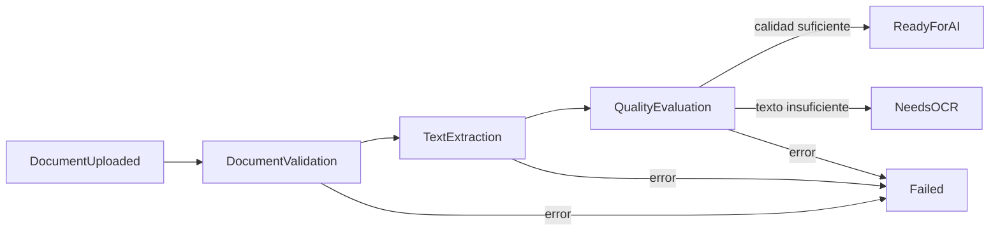
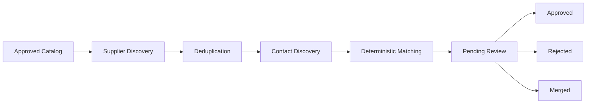
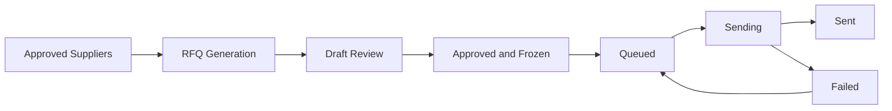

# SmartQuote AI

Plataforma para administrar licitaciones, almacenar documentos privados, extraer
catálogos con IA, gestionar proveedores y enviar RFQs mediante un pipeline
asíncrono auditable.

## Frontend

La aplicación web está en `frontend/` y ofrece un dashboard operativo para:

- crear y revisar licitaciones;
- cargar documentos PDF;
- solicitar extracción de catálogo;
- aprobar o rechazar productos;
- agregar, buscar, aprobar o rechazar proveedores;
- generar, aprobar y enviar RFQs;
- consultar el estado general del sistema.

Instalación:

```bash
cd frontend
npm install
```

Ejecución local:

```bash
cd frontend
npm run dev
```

URL:

```text
http://127.0.0.1:5173
```

Durante desarrollo, Vite redirige `/api` y `/health` hacia
`http://127.0.0.1:8001`. Si el backend se ejecuta en otra URL, configura:

```bash
VITE_API_BASE_URL=http://127.0.0.1:8001 npm run dev
```

Build de producción:

```bash
cd frontend
npm run build
```

La UI usa el usuario operativo por defecto
`00000000-0000-0000-0000-000000000001`, editable desde la barra lateral.

## Alcance actual

La Iteración 5 agrega:

- Celery como motor de tareas;
- Redis como broker y backend de resultados;
- detección periódica de documentos pendientes;
- extracción de texto por página;
- PyMuPDF como extractor primario;
- pdfplumber como fallback automático;
- evaluación de calidad documental;
- estados `queued`, `processing`, `text_extracted`, `ready_for_ai`, `needs_ocr` y `failed`;
- persistencia de páginas, ejecuciones, configuración, errores y métricas;
- endpoints de consulta para estado, páginas, calidad y extracción;
- logs estructurados en JSON.

Fuera de alcance: OpenAI, OCR, extracción de productos, proveedores, RFQs y procesamiento síncrono.

## Servicios

```bash
docker compose up --build
```

El entorno inicia:

| Servicio | Función |
|---|---|
| `api` | FastAPI y carga de documentos |
| `worker` | ejecución de etapas Celery |
| `beat` | detección periódica de documentos pendientes |
| `redis` | broker y backend Celery |
| `postgres` | metadatos, páginas, métricas y auditoría |

Aplicar migraciones:

```bash
docker compose run --rm api uv run alembic upgrade head
```

Swagger: `http://localhost:8000/docs`

## Pipeline documental



Las etapas se implementan como tareas Celery independientes:

- `smartquote.documents.validate`
- `smartquote.documents.extract_text`
- `smartquote.documents.evaluate_quality`
- `smartquote.documents.finalize`

La carga publica `smartquote.documents.start_pipeline`. El worker orquesta las etapas sin ejecutarlas en el proceso HTTP. Cada etapa también está registrada como tarea Celery independiente. Celery Beat ejecuta `smartquote.documents.detect_pending` para recuperar documentos `uploaded` o `queued` que no hayan sido consumidos.

## Flujo completo

1. `POST /api/v1/tenders/{id}/documents` valida y almacena el PDF privado.
2. Se registra `DocumentUploaded`.
3. El documento cambia de `uploaded` a `queued` y se registra `DocumentQueued`.
4. Después del commit SQL se publica la tarea en Redis.
5. El worker valida nuevamente firma y SHA-256 del archivo almacenado.
6. El documento pasa a `processing`.
7. PyMuPDF extrae texto página por página mediante `Page.get_text("text", sort=True)`.
8. Si falla o la extracción es insuficiente, se ejecuta pdfplumber.
9. Se persisten `ExtractionRun` y cada `DocumentPage`.
10. El documento pasa a `text_extracted`.
11. `DocumentQualityEvaluator` calcula métricas.
12. El documento termina en `ready_for_ai` o `needs_ocr`.
13. Los errores dejan evidencia en `ExtractionRun` y cambian el documento a `failed`.

## Persistencia

### `extraction_runs`

Conserva:

- extractor final y versión;
- configuración canónica;
- clave de idempotencia;
- inicio, final y duración;
- páginas y caracteres extraídos;
- resultado y errores;
- referencia a ejecución reutilizada cuando aplique.

### `document_pages`

Cada página conserva:

- número;
- texto;
- dimensiones;
- caracteres y palabras;
- indicador de página vacía;
- densidad aproximada;
- duración de extracción.

### `document_qualities`

Conserva:

- páginas procesadas y vacías;
- porcentaje de páginas sin texto;
- caracteres extraídos;
- densidad agregada;
- calidad estimada;
- decisión;
- indicador de revisión manual.

## Extractores

`DocumentTextExtractor` desacopla Application de las bibliotecas PDF.

```text
DocumentTextExtractor
├── PyMuPDFExtractor       # primario
└── PdfPlumberExtractor    # fallback
```

La estrategia intenta pdfplumber cuando PyMuPDF:

- produce una excepción;
- no alcanza el mínimo de caracteres;
- supera el porcentaje permitido de páginas vacías;
- no alcanza el promedio mínimo de caracteres por página.

Si ambos resultados existen, se conserva el de mayor cantidad de texto, menor porcentaje vacío y mayor cantidad de páginas.

## Evaluación de calidad

La densidad se calcula como caracteres extraídos entre el área total de las páginas en pulgadas cuadradas.

Decisiones:

- `ready_for_ai`: texto suficiente, pocas páginas vacías y densidad mínima;
- `needs_ocr`: documento vacío o con texto extremadamente escaso;
- `manual_review`: calidad intermedia; se conserva en `DocumentQuality` y el estado operativo se marca `needs_ocr` porque OCR/revisión serán resueltos en una iteración posterior.

Todos los umbrales son configurables mediante variables `SMARTQUOTE_QUALITY_*`.

## Idempotencia

La clave SHA-256 de procesamiento incluye:

- hash SHA-256 del PDF;
- nombre y versión de PyMuPDF;
- nombre y versión de pdfplumber;
- política de fallback;
- configuración de calidad/extracción aplicable.

Una ejecución completada con la misma clave se reutiliza. La restricción única `(document_id, processing_key)` evita ejecuciones válidas duplicadas.

## Endpoints de documentos

| Método | Ruta | Resultado |
|---|---|---|
| `POST` | `/api/v1/tenders/{id}/documents` | Carga PDFs y dispara el pipeline |
| `GET` | `/api/v1/documents/{id}/status` | Estado y fechas del procesamiento |
| `GET` | `/api/v1/documents/{id}/pages` | Texto y métricas por página |
| `GET` | `/api/v1/documents/{id}/quality` | Evaluación de calidad |
| `GET` | `/api/v1/documents/{id}/extraction` | Evidencia de la ejecución |
| `GET` | `/api/v1/documents/{id}/download` | Descarga privada |
| `DELETE` | `/api/v1/documents/{id}` | Eliminación lógica |

No existe endpoint HTTP para iniciar manualmente el pipeline.

## Ejemplo

```bash
curl -X POST http://localhost:8000/api/v1/tenders/TENDER_ID/documents \
  -F 'uploaded_by_user_id=00000000-0000-0000-0000-000000000001' \
  -F 'files=@bases.pdf;type=application/pdf'

curl http://localhost:8000/api/v1/documents/DOCUMENT_ID/status
curl http://localhost:8000/api/v1/documents/DOCUMENT_ID/pages
curl http://localhost:8000/api/v1/documents/DOCUMENT_ID/quality
curl http://localhost:8000/api/v1/documents/DOCUMENT_ID/extraction
```

## Configuración relevante

```text
SMARTQUOTE_CELERY_BROKER_URL=redis://redis:6379/0
SMARTQUOTE_CELERY_RESULT_BACKEND=redis://redis:6379/1
SMARTQUOTE_PENDING_DOCUMENT_SCAN_SECONDS=60
SMARTQUOTE_EXTRACTION_MINIMUM_CHARACTERS=100
SMARTQUOTE_EXTRACTION_MAXIMUM_EMPTY_PAGE_PERCENTAGE=60
SMARTQUOTE_QUALITY_READY_MINIMUM_CHARACTERS=200
SMARTQUOTE_QUALITY_READY_MAXIMUM_EMPTY_PAGE_PERCENTAGE=25
SMARTQUOTE_QUALITY_READY_MINIMUM_DENSITY=1.5
SMARTQUOTE_QUALITY_OCR_MAXIMUM_CHARACTERS=50
SMARTQUOTE_QUALITY_OCR_MINIMUM_EMPTY_PAGE_PERCENTAGE=50
SMARTQUOTE_QUALITY_OCR_MAXIMUM_DENSITY=0.5
```

## Pruebas

```bash
cd backend
uv sync
uv run alembic upgrade head
uv run pytest
uv run ruff check .
uv run python -m compileall app tests alembic
```

La suite incluye PDFs reales pequeños en `tests/fixtures/` y pruebas de:

- extractores;
- fallback;
- métricas;
- estados;
- pipeline completo;
- persistencia de páginas;
- idempotencia;
- endpoints;
- worker Celery con Redis real.

## Documentación técnica

- `docs/iteration-4-document-management.md`
- `docs/iteration-5-text-extraction-pipeline.md`
- `docs/continuous-integration.md`

## Iteración 6: extracción inteligente de catálogo

La Iteración 6 consume únicamente documentos `ready_for_ai` y crea un catálogo sugerido por IA. La respuesta no modifica directamente el dominio: primero se valida con JSON Schema estricto y Pydantic, después se normaliza con reglas determinísticas y finalmente queda en `pending_review`.

### Servicios y configuración

El worker Celery escucha dos colas:

```text
document-processing
ai-extraction
```

Variables principales:

```text
SMARTQUOTE_OPENAI_API_KEY
SMARTQUOTE_OPENAI_BASE_URL=https://api.openai.com/v1
SMARTQUOTE_OPENAI_TIMEOUT_SECONDS=90
SMARTQUOTE_AI_MODEL=gpt-5-mini
SMARTQUOTE_AI_PROMPT_VERSION=1.0.0
SMARTQUOTE_AI_TEMPERATURE=0
SMARTQUOTE_AI_INPUT_COST_PER_MILLION_TOKENS=0
SMARTQUOTE_AI_OUTPUT_COST_PER_MILLION_TOKENS=0
```

Los precios deben configurarse con la tarifa vigente del modelo contratado.

### Endpoints

| Método | Ruta | Función |
|---|---|---|
| `POST` | `/api/v1/tenders/{id}/catalog/extract` | Crea o reutiliza runs y encola extracción |
| `GET` | `/api/v1/tenders/{id}/catalog` | Catálogo, estados y métricas |
| `GET` | `/api/v1/catalog/{product_id}` | Producto, payload original y evidencia |
| `PUT` | `/api/v1/catalog/{product_id}` | Editar, aprobar o rechazar |
| `POST` | `/api/v1/tenders/{id}/catalog/approve` | Snapshot inmutable aprobado |

Ejemplo:

```bash
curl -X POST http://localhost:8000/api/v1/tenders/TENDER_ID/catalog/extract

curl http://localhost:8000/api/v1/tenders/TENDER_ID/catalog

curl -X PUT http://localhost:8000/api/v1/catalog/PRODUCT_ID \
  -H 'Content-Type: application/json' \
  -d '{
    "action": "edit",
    "reviewer_user_id": "00000000-0000-0000-0000-000000000001",
    "quantity": 2500,
    "unit": "m"
  }'

curl -X PUT http://localhost:8000/api/v1/catalog/PRODUCT_ID \
  -H 'Content-Type: application/json' \
  -d '{
    "action": "approve",
    "reviewer_user_id": "00000000-0000-0000-0000-000000000001"
  }'

curl -X POST http://localhost:8000/api/v1/tenders/TENDER_ID/catalog/approve \
  -H 'Content-Type: application/json' \
  -d '{"approved_by_user_id":"00000000-0000-0000-0000-000000000001"}'
```

### Prompts y trazabilidad

El prompt activo está versionado en `backend/app/prompts/catalog_extraction/v1/prompt.json`. La clave idempotente incluye hash del PDF, versión del prompt, modelo y hash del schema. Cada producto conserva el JSON original, página, fragmento, confianza, modelo y prompt; las ediciones humanas se guardan como revisiones separadas.

La explicación técnica completa está en `docs/ai-extraction.md`.

Fuera de alcance: proveedores, RFQs, recepción de correo y análisis de cotizaciones.

## Iteración 7: descubrimiento y gestión de proveedores

La Iteración 7 parte únicamente del último snapshot de catálogo aprobado. El descubrimiento se ejecuta en Celery y deja candidatos para revisión humana; nunca aprueba ni elimina proveedores automáticamente.

### Flujo



El modelo distingue:

- `Supplier`: maestro global reutilizable;
- `TenderSupplier`: estado y contexto dentro de una licitación;
- `SupplierContact`: correo, teléfono, WhatsApp o formulario con confianza y fuente;
- `SupplierSource`: evidencia del hallazgo;
- `ProductSupplierMatch`: score explicable por producto.

### Configuración

```text
SMARTQUOTE_SUPPLIER_DIRECTORY_PATH=app/supplier_sources/default_directory.json
SMARTQUOTE_SUPPLIER_SEARCH_COUNTRY=MX
SMARTQUOTE_SUPPLIER_SEARCH_MAX_RESULTS_PER_PRODUCT=10
SMARTQUOTE_SUPPLIER_MATCHING_ALGORITHM_VERSION=1.0.0
```

El worker debe escuchar también la cola `supplier-discovery`:

```bash
uv run celery -A app.infrastructure.tasks.celery_app:celery_app worker \
  --loglevel=INFO \
  --queues=document-processing,ai-extraction,supplier-discovery
```

### Endpoints

| Método | Ruta |
|---|---|
| `POST` | `/api/v1/tenders/{id}/suppliers/discover` |
| `GET` | `/api/v1/tenders/{id}/suppliers` |
| `GET` | `/api/v1/suppliers/{id}` |
| `PUT` | `/api/v1/suppliers/{id}` |
| `POST` | `/api/v1/suppliers/{id}/approve` |
| `POST` | `/api/v1/suppliers/{id}/reject` |
| `POST` | `/api/v1/suppliers/merge` |
| `POST` | `/api/v1/suppliers/manual` |

Ejemplo:

```bash
curl -X POST http://localhost:8000/api/v1/tenders/TENDER_ID/suppliers/discover \
  -H 'Content-Type: application/json' \
  -d '{"requested_by_user_id":"00000000-0000-0000-0000-000000000001"}'

curl http://localhost:8000/api/v1/tenders/TENDER_ID/suppliers

curl -X POST http://localhost:8000/api/v1/suppliers/TENDER_SUPPLIER_ID/approve \
  -H 'Content-Type: application/json' \
  -d '{"reviewer_user_id":"00000000-0000-0000-0000-000000000001"}'
```

El matching es determinístico y pondera nombre (35), categoría (25), palabras clave (20) y especificaciones (20). La deduplicación prioriza dominio, correo y teléfono, y usa nombres como señales adicionales. Las coincidencias inciertas generan sugerencias de fusión para revisión.

La documentación completa está en `docs/supplier-discovery.md`.

Fuera de alcance: RFQs, envío de correos, monitoreo de respuestas y análisis de cotizaciones.

## Iteración 8: generación y envío de RFQs

La Iteración 8 toma el último catálogo aprobado y los proveedores aprobados de una licitación para generar solicitudes de cotización revisables. La RFQ de negocio permanece separada de cada intento de correo; el dominio depende de puertos y nunca conoce SMTP.

### Flujo



### Configuración SMTP y empresa

```text
SMARTQUOTE_COMPANY_NAME=SmartQuote AI
SMARTQUOTE_COMPANY_CONTACT_NAME=Equipo de Compras
SMARTQUOTE_COMPANY_EMAIL=procurement@smartquote.local
SMARTQUOTE_RFQ_TEMPLATE_NAME=supplier_rfq
SMARTQUOTE_RFQ_TEMPLATE_VERSION=1.0.0
SMARTQUOTE_MAX_EMAIL_ATTACHMENT_BYTES=26214400
SMARTQUOTE_SMTP_HOST=mailpit
SMARTQUOTE_SMTP_PORT=1025
SMARTQUOTE_SMTP_USE_TLS=false
SMARTQUOTE_SMTP_USE_SSL=false
SMARTQUOTE_SMTP_SENDER_EMAIL=procurement@smartquote.local
SMARTQUOTE_SMTP_SENDER_NAME=SmartQuote AI Compras
SMARTQUOTE_SMTP_MESSAGE_ID_DOMAIN=smartquote.local
```

El worker debe escuchar también `rfq-delivery`:

```bash
uv run celery -A app.infrastructure.tasks.celery_app:celery_app worker \
  --loglevel=INFO \
  --queues=document-processing,ai-extraction,supplier-discovery,rfq-delivery
```

Docker Compose incluye Mailpit para desarrollo. Su interfaz se abre en `http://localhost:8025` y recibe SMTP en el puerto `1025`.

### Endpoints

| Método | Ruta |
|---|---|
| `POST` | `/api/v1/tenders/{id}/rfqs/generate` |
| `GET` | `/api/v1/tenders/{id}/rfqs` |
| `GET` | `/api/v1/rfqs/{id}` |
| `PUT` | `/api/v1/rfqs/{id}` |
| `POST` | `/api/v1/rfqs/{id}/approve` |
| `POST` | `/api/v1/rfqs/{id}/cancel` |
| `POST` | `/api/v1/rfqs/{id}/send` |
| `GET` | `/api/v1/rfqs/{id}/messages` |

Ejemplo mínimo:

```bash
curl -X POST http://localhost:8000/api/v1/tenders/TENDER_ID/rfqs/generate \
  -H 'Content-Type: application/json' \
  -d '{
    "generated_by_user_id":"00000000-0000-0000-0000-000000000001",
    "response_deadline":"2026-08-15T18:00:00-06:00",
    "observations":"Indicar vigencia, entrega e impuestos"
  }'

curl -X PUT http://localhost:8000/api/v1/rfqs/RFQ_ID \
  -H 'Content-Type: application/json' \
  -d '{
    "changed_by_user_id":"00000000-0000-0000-0000-000000000001",
    "to_recipients":["ventas@proveedor.example","cotizaciones@proveedor.example"],
    "subject":"Solicitud de cotización — entrega prioritaria"
  }'

curl -X POST http://localhost:8000/api/v1/rfqs/RFQ_ID/approve \
  -H 'Content-Type: application/json' \
  -d '{"approved_by_user_id":"00000000-0000-0000-0000-000000000001"}'

curl -X POST http://localhost:8000/api/v1/rfqs/RFQ_ID/send \
  -H 'Content-Type: application/json' \
  -d '{"requested_by_user_id":"00000000-0000-0000-0000-000000000001"}'
```

La plantilla inicial está versionada en `backend/app/email_templates/rfq/v1/template.json`. Los adjuntos conservan nombre, SHA-256, tamaño y MIME, y se validan nuevamente antes de SMTP. Al aprobar, contenido, destinatarios y adjuntos quedan congelados. La idempotencia considera `rfq_id`, versión y el contenido aprobado; un reintento usa la misma RFQ y crea un nuevo intento de mensaje.

La documentación técnica completa está en `docs/rfq.md`.

Fuera de alcance: monitoreo automático del buzón, lectura de respuestas, análisis de cotizaciones y comparativos.
