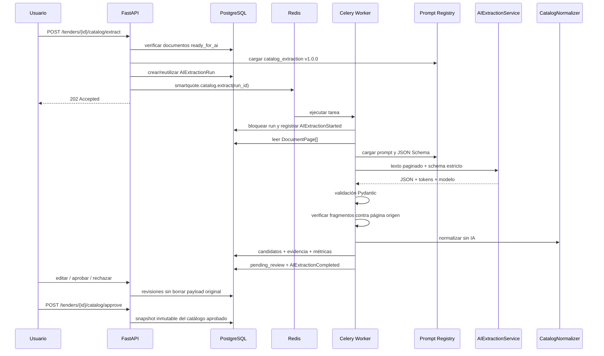

# Extracción inteligente de productos

## Alcance

La Iteración 6 transforma el texto por página generado en la Iteración 5 en productos estructurados y revisables. La IA solo propone candidatos. Ninguna respuesta del proveedor modifica directamente entidades del dominio: la capa Application valida el JSON, construye entidades, ejecuta la normalización determinística y persiste evidencia antes de iniciar la revisión humana.

No se implementan proveedores, RFQs, correo ni análisis de cotizaciones.

## Arquitectura

```text
FastAPI
├── POST /tenders/{id}/catalog/extract
├── consultas de catálogo
└── edición/aprobación/rechazo
Application
├── RequestTenderCatalogExtraction
├── ProcessAIExtractionRun
├── CatalogNormalizer
├── AIExtractionService (puerto)
├── AIExtractionQueue (puerto)
├── PromptRegistry (puerto)
└── CatalogRepository (puerto)
Domain
├── AIExtractionRun
├── CatalogProduct
├── ExtractedEvidence
├── EvidenceReference
├── CatalogSnapshot
└── máquinas de estados y eventos
Infrastructure
├── OpenAIExtractionService
├── OpenAIResponsesHTTPClient
├── FilePromptRegistry
├── Celery / Redis
└── SQLAlchemy / Alembic
```

`OpenAIExtractionService` es el único adaptador que conoce el contrato de OpenAI. Usa el endpoint Responses con Structured Outputs, JSON Schema estricto y `store=false`. El cliente HTTP queda detrás del adaptador y puede sustituirse por el SDK oficial u otro transporte sin modificar Domain ni casos de uso.

## Flujo



## Gestión de prompts

Los prompts no están embebidos en casos de uso. Se almacenan en:

```text
backend/app/prompts/catalog_extraction/v1/prompt.json
```

Cada definición contiene:

- nombre y descripción;
- `version` del prompt;
- `schema_version`;
- instrucciones del sistema;
- plantilla de entrada;
- JSON Schema de salida.

`FilePromptRegistry` resuelve una versión explícita. Cambiar el prompt, el modelo o el esquema produce una nueva clave de idempotencia y permite una nueva extracción sin eliminar las anteriores.

## JSON esperado

```json
{
  "products": [
    {
      "item_number": "1",
      "name": "Cable de cobre",
      "description": "Conductor eléctrico con aislamiento XLPE",
      "quantity": 2000,
      "unit": "metros",
      "suggested_category": "Eléctrico",
      "technical_specifications": [
        {"name": "Calibre", "value": "2 AWG"},
        {"name": "Tensión", "value": "600 V"}
      ],
      "observations": "Entrega en almacén central",
      "confidence": 0.94,
      "evidence": [
        {
          "page": 1,
          "fragment": "Cable de cobre 2 AWG, cantidad 2000 metros.",
          "confidence": 0.97,
          "coordinates": null
        }
      ]
    }
  ]
}
```

No se acepta texto libre. El proveedor recibe un JSON Schema con `additionalProperties=false`; después la aplicación valida de nuevo la respuesta con Pydantic. Campos faltantes, tipos incorrectos, confianza fuera de rango, evidencia vacía o propiedades desconocidas provocan `AIResponseValidationError` y la ejecución queda en `failed`.

## Trazabilidad

La trazabilidad se mantiene en cuatro niveles:

1. `AIExtractionRun` registra documento, hash de idempotencia, modelo, prompt, schema, temperatura, tokens, costo, duración, respuesta estructurada y errores.
2. `CatalogProduct.original_payload` conserva sin cambios el objeto producido por la IA.
3. `ExtractedEvidence` relaciona producto, documento, página, fragmento, confianza, modelo y prompt.
4. `EvidenceReference` conserva coordenadas cuando el documento las proporciona.

Antes de persistir evidencia se compactan los espacios y se exige que el fragmento sea una subcadena exacta del texto guardado para esa página. Una referencia inventada revierte toda la creación de candidatos de esa ejecución.

Las ediciones humanas actualizan solo la vista revisable del producto. Cada cambio genera una fila en `catalog_product_revisions` con el estado anterior, posterior, usuario y campos modificados. El payload original nunca se sobrescribe.

## Normalización determinística

`CatalogNormalizer` no usa IA. Ejecuta:

- limpieza de espacios;
- unificación de aliases de unidades;
- conversiones determinísticas (`g → kg`, `mL → L`, `cm/mm → m`) cuando el valor permite una unidad superior;
- limpieza de especificaciones;
- categorías por reglas de palabras clave;
- fingerprint SHA-256 para sugerir duplicados.

La detección de duplicados no elimina registros. Solo establece `duplicate_of_product_id` para que el revisor decida.

## Estados

```text
candidate → normalized → pending_review → approved
                                      └→ rejected
```

No se permiten saltos ni modificaciones después de `approved` o `rejected`.

El catálogo completo se aprueba únicamente cuando todos los productos están `approved` o `rejected` y existe al menos uno aprobado. El snapshot contiene los valores revisados y referencias de origen, y nunca modifica la extracción histórica.

## Idempotencia

```text
idempotency_key = SHA256(
    document_file_hash
    + prompt_version
    + model
    + schema_hash
)
```

La base aplica una restricción única por `(document_id, idempotency_key)`. Una ejecución `completed` se reutiliza. Una ejecución `failed` puede reintentarse con la misma fila. Cambiar cualquier componente genera una nueva ejecución y conserva el historial anterior.

## Costo y tokens

El adaptador lee `usage.input_tokens` y `usage.output_tokens`. El costo estimado se calcula con precios configurables:

```text
cost_usd =
    input_tokens × input_price_per_million / 1,000,000
  + output_tokens × output_price_per_million / 1,000,000
```

Los precios se configuran mediante:

```text
SMARTQUOTE_AI_INPUT_COST_PER_MILLION_TOKENS
SMARTQUOTE_AI_OUTPUT_COST_PER_MILLION_TOKENS
```

Se mantienen fuera del código porque las tarifas pueden cambiar. El ejemplo de pruebas usa 900 tokens de entrada, 240 de salida, USD 1.00/M de entrada y USD 3.00/M de salida, para un costo estimado de USD 0.001620.

## Seguridad y manejo de errores

- La clave API es `SecretStr` y solo se lee dentro del worker.
- No se registra la clave ni se devuelve por HTTP.
- `store=false` evita solicitar almacenamiento de la respuesta al proveedor.
- La API web no llama al proveedor de forma síncrona.
- Las respuestas se limitan al schema y luego se validan localmente.
- Errores de red se clasifican como `AIExtractionFailure` y Celery puede reintentarlos.
- Errores de JSON o evidencia son permanentes y quedan auditados.

## Observabilidad

Por documento se registran:

- duración;
- modelo y prompt;
- tokens de entrada y salida;
- costo estimado;
- productos detectados;
- errores de validación.

Por licitación, `GET /api/v1/tenders/{id}/catalog` calcula:

- totales y estados de productos;
- confianza promedio;
- porcentaje de productos editados manualmente;
- tokens y costo acumulado.

## Pruebas

La suite cubre:

- Value Objects y transiciones;
- normalización y conversiones;
- JSON válido, incompleto e inválido;
- adaptador OpenAI con proveedor simulado;
- persistencia de runs, productos y evidencia;
- fragmentos no trazables;
- idempotencia y cambio de modelo;
- edición, aprobación, rechazo y snapshots;
- worker Celery real con Redis, mockeando únicamente OpenAI.
