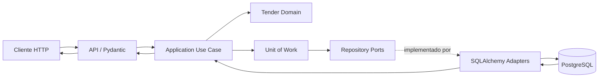

# Iteración 3: Tender Management

## Alcance implementado

- `CreateTender`
- `GetTender`
- `ListTenders`
- `UpdateTender`
- `ArchiveTender`
- API REST `/api/v1/tenders`
- validaciones Pydantic de entrada y salida
- reglas de negocio en Domain
- Unit of Work transaccional
- auditoría persistente
- manejo uniforme de errores
- pruebas unitarias y de integración

No se implementó carga de documentos, IA, OCR ni procesamiento de PDFs.

## Árbol actualizado

```text
.github/
└── workflows/
    └── iteration-3-ci.yml
backend/
├── alembic/
│   └── versions/
│       ├── 9f6e762a7fc6_create_initial_core_tables.py
│       └── c842c17be491_add_tender_audit_events.py
├── app/
│   ├── api/
│   │   ├── dependencies.py
│   │   ├── error_handlers.py
│   │   ├── schemas.py
│   │   └── routes/
│   │       ├── health.py
│   │       └── tenders.py
│   ├── application/
│   │   ├── dtos/
│   │   │   └── tender.py
│   │   ├── exceptions.py
│   │   ├── ports/
│   │   │   ├── audit_event_repository.py
│   │   │   ├── tender_repository.py
│   │   │   ├── unit_of_work.py
│   │   │   └── user_lookup.py
│   │   └── use_cases/
│   │       └── tenders.py
│   ├── domain/
│   │   └── tenders/
│   │       ├── entities.py
│   │       ├── events.py
│   │       ├── exceptions.py
│   │       └── value_objects.py
│   ├── infrastructure/
│   │   └── db/
│   │       ├── models/
│   │       │   ├── audit_event.py
│   │       │   └── tender.py
│   │       ├── repositories/
│   │       │   ├── audit_event_repository.py
│   │       │   ├── tender_repository.py
│   │       │   └── user_lookup.py
│   │       ├── session.py
│   │       └── unit_of_work.py
│   └── main.py
└── tests/
    ├── integration/
    │   ├── test_migrations.py
    │   ├── test_tender_endpoints.py
    │   └── test_tender_repository.py
    └── unit/
        ├── application/
        │   └── test_tender_use_cases.py
        └── domain/
            ├── test_shared_and_document_domain.py
            └── test_tender_domain.py
```

## Flujo completo

1. FastAPI recibe la petición y Pydantic valida UUIDs, fechas, longitudes y estados.
2. El router convierte el schema HTTP en un DTO de Application.
3. El caso de uso abre un `UnitOfWork`.
4. Application consulta los puertos necesarios y obtiene la entidad de dominio.
5. `Tender` ejecuta las invariantes y transiciones.
6. El repositorio traduce Domain a SQLAlchemy mediante el mapper.
7. El caso de uso registra el evento mínimo de auditoría.
8. El Unit of Work confirma ambas escrituras dentro de la misma transacción.
9. Application devuelve un `TenderResponse` independiente del dominio.
10. FastAPI lo convierte en el schema HTTP de salida.

## Diagrama de interacción



## Reglas adicionales justificadas

### Longitud de descripción: 5,000 caracteres

Evita payloads y registros sin límite, manteniendo espacio suficiente para una descripción operativa. Se valida tanto en Pydantic como en Domain.

### Zona horaria obligatoria en HTTP

Impide comparaciones ambiguas entre clientes y servidor. Domain normaliza fechas a UTC para conservar consistencia al recuperar datos desde distintos motores.

### Existencia del creador

La tabla `tenders` ya tiene una llave foránea hacia `users`. Validar antes de persistir produce un error de negocio claro en lugar de exponer una excepción de infraestructura.

### `PUT` como reemplazo completo

`title`, `description`, `deadline` y `status` representan el estado editable completo. Esto evita semántica parcial ambigua; una futura actualización parcial debe agregarse mediante `PATCH`.

### Actualizaciones sin cambios

Se permite repetir el mismo contenido, pero no se genera `TenderUpdated` porque no hubo modificación efectiva.

## Estados

| Estado actual | Estados siguientes permitidos |
|---|---|
| `draft` | `documents_pending`, `cancelled` |
| `documents_pending` | `documents_processing`, `cancelled` |
| `documents_processing` | `catalog_review`, `cancelled` |
| `catalog_review` | `closed`, `cancelled` |
| `cancelled` | ninguno |
| `closed` | ninguno |

## Auditoría

La auditoría no almacena copias completas de la entidad:

| Evento | Payload |
|---|---|
| `TenderCreated` | `title` |
| `TenderUpdated` | `changed_fields` |
| `TenderArchived` | `{}` |

Todos los eventos se confirman en la misma transacción que la licitación.

## Resultado local

- Pruebas: `28 passed`
- Cobertura total: `94%`
- Compilación: `python -m compileall` exitosa
- Base usada para la ejecución local: SQLite mediante las mismas migraciones de Alembic
- Base objetivo del proyecto: PostgreSQL 16

## Archivos creados

- `.github/workflows/iteration-3-ci.yml`
- `backend/alembic/versions/c842c17be491_add_tender_audit_events.py`
- `backend/app/api/dependencies.py`
- `backend/app/api/error_handlers.py`
- `backend/app/api/schemas.py`
- `backend/app/api/routes/tenders.py`
- `backend/app/application/dtos/tender.py`
- `backend/app/application/exceptions.py`
- `backend/app/application/ports/audit_event_repository.py`
- `backend/app/application/ports/unit_of_work.py`
- `backend/app/application/ports/user_lookup.py`
- `backend/app/application/use_cases/tenders.py`
- `backend/app/domain/tenders/events.py`
- `backend/app/domain/tenders/exceptions.py`
- `backend/app/infrastructure/db/models/audit_event.py`
- `backend/app/infrastructure/db/repositories/audit_event_repository.py`
- `backend/app/infrastructure/db/repositories/user_lookup.py`
- `backend/app/infrastructure/db/unit_of_work.py`
- `backend/tests/integration/test_tender_endpoints.py`
- `backend/tests/unit/application/test_tender_use_cases.py`
- `backend/tests/unit/domain/test_shared_and_document_domain.py`
- `docs/iteration-3-tender-management.md`


## Archivos modificados

- `README.md`
- `backend/alembic/env.py`
- `backend/app/main.py`
- `backend/app/application/ports/tender_repository.py`
- `backend/app/domain/tenders/entities.py`
- `backend/app/infrastructure/db/models/__init__.py`
- `backend/app/infrastructure/db/repositories/tender_repository.py`
- `backend/app/infrastructure/db/session.py`
- `backend/pyproject.toml`
- `backend/tests/conftest.py`
- `backend/tests/integration/test_migrations.py`
- `backend/tests/integration/test_tender_repository.py`
- `backend/tests/test_health.py`
- `backend/tests/unit/domain/test_tender_domain.py`

## Mejoras posibles para la Iteración 4

- autenticación y actor real de auditoría;
- paginación y filtros de licitaciones;
- control de concurrencia optimista;
- patrón Outbox para publicar eventos;
- `PATCH` para cambios parciales;
- métricas y trazabilidad distribuida;
- preparación de puertos para carga de documentos, únicamente después de aprobación.
