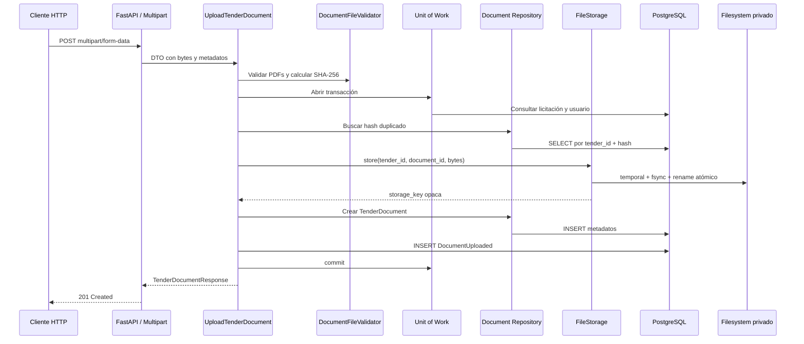

# Iteración 4: Gestión de Documentos y Almacenamiento

## Alcance implementado

Casos de uso de Application:

- `UploadTenderDocument`
- `GetTenderDocument`
- `ListTenderDocuments`
- `DeleteTenderDocument`
- `DownloadTenderDocument`

Capacidades entregadas:

- carga individual o múltiple mediante `multipart/form-data`;
- validación de nombre, extensión, MIME declarado, firma binaria, tamaño y cantidad;
- cálculo SHA-256 y detección de duplicados por licitación;
- almacenamiento privado local;
- persistencia de metadatos;
- consulta, listado, descarga y eliminación lógica;
- auditoría de cargas, eliminaciones y duplicados;
- punto de extensión para antivirus futuro.

No se implementó extracción de texto, OCR, PyMuPDF, IA, almacenamiento en la nube, colas ni tareas asíncronas.

## Árbol actualizado

```text
SmartQuote-AI/
├── .env.example
├── .github/
│   └── workflows/
│       └── iteration-3-ci.yml
├── backend/
│   ├── alembic/versions/
│   │   └── d914a6b4f2c1_document_management.py
│   ├── app/
│   │   ├── api/
│   │   │   ├── dependencies.py
│   │   │   ├── document_schemas.py
│   │   │   ├── multipart.py
│   │   │   └── routes/documents.py
│   │   ├── application/
│   │   │   ├── dtos/document.py
│   │   │   ├── ports/
│   │   │   │   ├── document_repository.py
│   │   │   │   ├── file_storage.py
│   │   │   │   └── file_threat_scanner.py
│   │   │   ├── services/document_validation.py
│   │   │   └── use_cases/documents.py
│   │   ├── domain/
│   │   │   ├── documents/
│   │   │   │   ├── entities.py
│   │   │   │   ├── events.py
│   │   │   │   ├── exceptions.py
│   │   │   │   └── value_objects.py
│   │   │   └── shared/events.py
│   │   └── infrastructure/
│   │       ├── db/
│   │       │   ├── mappers/document_mapper.py
│   │       │   ├── repositories/document_repository.py
│   │       │   └── unit_of_work.py
│   │       └── storage/local_file_storage.py
│   └── tests/
│       ├── integration/
│       │   ├── test_document_endpoints.py
│       │   └── test_document_repository.py
│       └── unit/
│           ├── application/
│           ├── domain/
│           └── infrastructure/
├── docker-compose.yml
├── docs/continuous-integration.md
├── docs/iteration-4-document-management.md
└── README.md
```

## Flujo de carga

1. FastAPI recibe `multipart/form-data`.
2. La capa API limita el cuerpo y separa el UUID del usuario y los archivos.
3. El router crea DTOs de Application.
4. `DocumentFileValidator` valida cada archivo y calcula SHA-256.
5. `UploadTenderDocument` abre un Unit of Work.
6. Se comprueba que la licitación exista y permita cargas.
7. Se comprueba que el usuario responsable exista.
8. Se buscan duplicados dentro de la solicitud y en la base de datos.
9. `LocalFileStorage` escribe cada PDF con una clave interna segura.
10. El repositorio persiste `TenderDocument` y los eventos de auditoría.
11. La primera carga cambia la licitación de `draft` a `documents_pending`.
12. El Unit of Work confirma metadatos, estado y auditoría en una transacción.
13. Si la persistencia falla después de escribir archivos, Application ejecuta eliminación compensatoria.

## Diagrama HTTP → almacenamiento físico



## FileStorage y LocalFileStorage

`FileStorage` es un puerto de Application con tres operaciones:

```python
store(tender_id, document_id, content) -> str
read(storage_key) -> bytes
delete(storage_key) -> None
```

`LocalFileStorage` usa esta estructura:

```text
<storage_root>/
└── tenders/
    └── <tender_uuid>/
        └── <document_uuid>.pdf
```

Características:

- raíz configurable y privada;
- nombres físicos basados exclusivamente en UUID;
- nombre original almacenado solo como metadato;
- rutas resueltas y verificadas dentro de la raíz;
- bloqueo de rutas absolutas, `..` y separadores no permitidos;
- directorios privados y archivos con permisos `0600` cuando el sistema lo permite;
- archivo temporal exclusivo, `flush`, `fsync` y sustitución atómica.

Para sustituirlo por MinIO o S3 se crea otro adaptador de `FileStorage` y se cambia `get_file_storage`. Domain, DTOs, casos de uso y endpoints permanecen sin cambios.

## Reglas y decisiones técnicas

### Validación PDF

Se exigen simultáneamente:

- extensión `.pdf`;
- MIME declarado `application/pdf`;
- firma `%PDF-` en los primeros 1,024 bytes;
- contenido no vacío;
- tamaño máximo configurable.

La firma verifica el tipo binario sin interpretar ni extraer contenido. No sustituye antivirus ni validación estructural profunda.

### Licitaciones que aceptan documentos

Solo aceptan cargas:

- `draft`;
- `documents_pending`.

Se bloquean licitaciones archivadas, cerradas, canceladas o que ya avanzaron a procesamiento o revisión. Esto mantiene inmutable la evidencia una vez iniciado el flujo posterior.

### Duplicados

La combinación `(tender_id, file_hash)` sigue siendo única incluso después de soft delete. Así no se puede reintroducir el mismo archivo con otro nombre y se conserva una historia de auditoría coherente.

### Eliminación lógica

`DeleteTenderDocument` cambia el estado a `deleted` y registra `deleted_at`. El documento deja de listarse, consultarse y descargarse, pero el archivo físico permanece privado.

Se conserva porque todavía no existe una política aprobada de retención, recuperación administrativa y purga física. La eliminación definitiva debe añadirse con autorización y auditoría específicas.

### Carga múltiple y compensación

Todos los archivos se validan antes de escribir. Si una escritura o persistencia falla:

- la transacción SQL se revierte;
- los archivos recién almacenados se eliminan mediante compensación.

Esto reduce metadatos sin archivo y archivos huérfanos.

### Memoria

Los archivos se mantienen como bytes en memoria durante esta iteración. El riesgo queda limitado por tamaño, cantidad y límite total del cuerpo multipart. La carga y descarga streaming es una mejora recomendada antes de aumentar esos límites.

### Antivirus futuro

`FileThreatScanner` define el punto de extensión. `UploadTenderDocument` puede invocarlo después de la validación de tipo y antes del almacenamiento. No existe un motor antivirus conectado en esta iteración.

## Persistencia

La migración `d914a6b4f2c1`:

- agrega `deleted_at`;
- restringe estados a `uploaded`, `deleted` y `rejected`;
- crea un índice para `deleted_at`;
- conserva la unicidad del hash por licitación;
- soporta upgrade y downgrade en PostgreSQL y SQLite de pruebas.

Metadatos conservados:

- nombre original;
- clave privada de almacenamiento;
- MIME;
- tamaño;
- SHA-256;
- usuario responsable;
- estado;
- fechas de carga, actualización y eliminación.

## Auditoría

| Evento | Agregado | Datos mínimos |
|---|---|---|
| `DocumentUploaded` | documento | licitación, usuario y hash |
| `DocumentDeleted` | documento | licitación, usuario y hash |
| `DuplicateDocumentDetected` | licitación | usuario, hash y nombre original |

La detección de duplicado se confirma antes de devolver `409`, aunque la carga principal no se ejecute.

## Seguridad

- almacenamiento fuera de rutas públicas;
- UUID como nombre físico;
- nombre original limitado a 255 caracteres;
- rechazo de `/`, `\`, `..` y caracteres de control;
- claves relativas y confinadas en la raíz privada;
- límites por archivo, cantidad y cuerpo multipart;
- extensión, MIME y firma binaria;
- `Content-Disposition: attachment` y `X-Content-Type-Options: nosniff`;
- rutas físicas y storage keys ausentes en respuestas API;
- usuario obligatorio para carga y eliminación.

## Resultado local

- Pytest: `46 passed`.
- Cobertura total: `95%`.
- Compilación: `python -m compileall app tests alembic` aprobada.
- Contrato OpenAPI, incluida la carga multipart: aprobado.
- Migraciones SQLite de pruebas: upgrade y teardown/downgrade aprobados.

GitHub Actions valida adicionalmente Ruff, PostgreSQL 16, ciclo de migraciones, cobertura, OpenAPI y build Docker.

## Mejoras posibles para la Iteración 5

- autenticación y autorización por licitación y documento;
- carga y descarga streaming;
- antivirus mediante `FileThreatScanner`;
- política de retención y purga física;
- reconciliación de archivos huérfanos;
- control de concurrencia para duplicados simultáneos;
- adaptadores MinIO o S3;
- cifrado administrado y rotación de claves;
- cuotas por usuario o licitación;
- posteriormente, y solo con aprobación, extracción de texto como módulo independiente.
