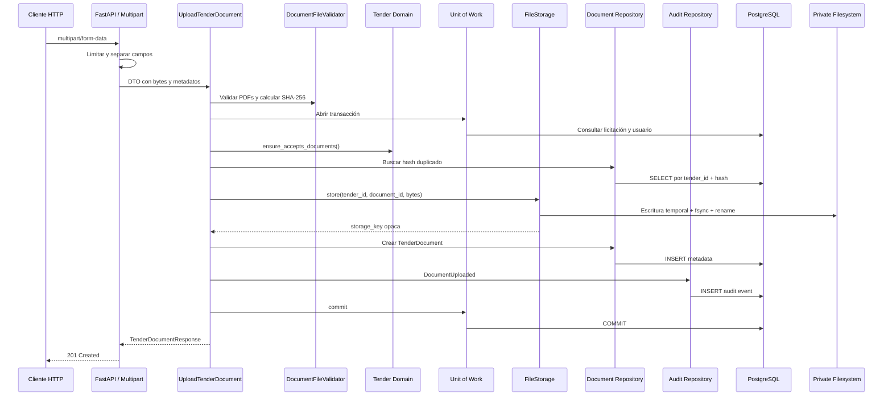

# Iteración 4: Gestión de Documentos y Almacenamiento

## Alcance implementado

Casos de uso de Application:

- `UploadTenderDocument`
- `GetTenderDocument`
- `ListTenderDocuments`
- `DeleteTenderDocument`
- `DownloadTenderDocument`

Capacidades:

- carga individual o múltiple de PDFs;
- validación de nombre, extensión, MIME declarado, firma binaria, tamaño y cantidad;
- SHA-256 y detección de duplicados por licitación;
- almacenamiento privado local;
- persistencia de metadatos;
- consulta, listado, descarga y eliminación lógica;
- auditoría de carga, eliminación y duplicado;
- punto de extensión para antivirus futuro.

No se implementó extracción de texto, OCR, PyMuPDF, IA, colas ni tareas asíncronas.

## Árbol actualizado

```text
SmartQuote-AI/
├── .env.example
├── .github/
│   └── workflows/
│       └── smartquote-ci.yml
├── backend/
│   ├── alembic/
│   │   └── versions/
│   │       └── d914a6b4f2c1_document_management.py
│   ├── app/
│   │   ├── api/
│   │   │   ├── dependencies.py
│   │   │   ├── document_schemas.py
│   │   │   ├── error_handlers.py
│   │   │   ├── multipart.py
│   │   │   └── routes/
│   │   │       └── documents.py
│   │   ├── application/
│   │   │   ├── dtos/
│   │   │   │   └── document.py
│   │   │   ├── ports/
│   │   │   │   ├── document_repository.py
│   │   │   │   ├── file_storage.py
│   │   │   │   └── file_threat_scanner.py
│   │   │   ├── services/
│   │   │   │   └── document_validation.py
│   │   │   └── use_cases/
│   │   │       └── documents.py
│   │   ├── domain/
│   │   │   ├── documents/
│   │   │   │   ├── entities.py
│   │   │   │   ├── events.py
│   │   │   │   ├── exceptions.py
│   │   │   │   └── value_objects.py
│   │   │   └── shared/
│   │   │       └── events.py
│   │   ├── infrastructure/
│   │   │   ├── db/
│   │   │   │   ├── mappers/document_mapper.py
│   │   │   │   ├── repositories/document_repository.py
│   │   │   │   └── unit_of_work.py
│   │   │   └── storage/
│   │   │       └── local_file_storage.py
│   │   └── main.py
│   └── tests/
│       ├── integration/
│       │   ├── test_document_endpoints.py
│       │   └── test_document_repository.py
│       └── unit/
│           ├── application/
│           │   ├── test_document_use_cases.py
│           │   └── test_document_validation.py
│           ├── domain/test_shared_and_document_domain.py
│           └── infrastructure/test_local_file_storage.py
├── docker-compose.yml
├── docs/
│   ├── continuous-integration.md
│   └── iteration-4-document-management.md
└── README.md
```

## Flujo de carga

1. FastAPI recibe `multipart/form-data`.
2. `api.multipart` limita el tamaño total y separa `uploaded_by_user_id` y los archivos.
3. El router construye DTOs de Application sin exponer `UploadFile` fuera de API.
4. `DocumentFileValidator` valida cada archivo y calcula SHA-256.
5. `UploadTenderDocument` abre un Unit of Work.
6. Se comprueba que la licitación exista y acepte documentos.
7. Se comprueba que el usuario responsable exista.
8. Se buscan hashes repetidos tanto en la solicitud como en la base.
9. `LocalFileStorage` escribe cada archivo con una clave interna segura.
10. El repositorio persiste `TenderDocument` y el evento `DocumentUploaded`.
11. La primera carga mueve la licitación de `draft` a `documents_pending`.
12. El Unit of Work confirma metadatos, estado y auditoría.
13. Si falla la base después de escribir archivos, Application ejecuta eliminación compensatoria de los archivos nuevos.

## Diagrama del flujo



## Implementación de FileStorage

`FileStorage` es un puerto de Application con tres operaciones:

- `store`: recibe UUID de licitación, UUID de documento y bytes; devuelve una clave opaca.
- `read`: recupera bytes desde una clave.
- `delete`: elimina físicamente una clave; se usa para compensar cargas fallidas y queda disponible para políticas oe purga futuras.

`LocalFileStorage` es el primer adaptador:

```text
<root>/tenders/<tender_uuid>/<document_uuid>.pdf
```

Propiedades:

- raíz configurable;
- archivos fuera de directorios públicos;
- rutas construidas únicamente con UUIDs;
- verificación con `resolve` y `relative_to` para bloquear path traversal;
- directorios privados;
- archivo temporal exclusivo;
- `flush` y `fsync`;
- sustitución atómica con `os.replace`;
- permisos `0600` cuando el sistema operativo lo permite.

El nombre original nunca forma parte de la ruta física. Se persiste por separado y solo se usa en metadatos y `Content-Disposition`.

Un adaptador MinIO o S3 debe implementar el mismo puerto y sustituirse en `get_file_storage`; no requiere cambios en Domain ni en los casos de uso.

## Decisiones técnicas

### Firma PDF como validación de tipo real

Se exige:

- extensión `.pdf`;
- MIME declarado `application/pdf`;
- firma `%PDF-` en los primeros 1,024 bytes.

La firma comprueba el tipo binario sin interpretar el contenido. No garantiza que toda la estructura sea válida y no reemplaza antivirus ni un parser PDF, que permanecen fuera del alcance.

### Parser multipart en el límite HTTP

La API usa el parser MIME de la biblioteca estándar para mantener los objetos HTTP dentro de la capa API. Application recibe bytes y DTOs puros. El contrato multipart se declara manualmente en OpenAPI para conservar compatibilidad con Swagger.

El cuerpo se limita antes de parsearse a:

```text
maximum_file_size × maximum_files + 1 MiB de overhead
```

### Carga múltiple atómica en metadatos

Todos los archivos se validan antes de escribir. Si una escritura o persistencia falla:

- la transacción SQL se revierte;
- los archivos nuevos se eliminan mediante compensación.

Esto evita metadatos sin archivo y reduce archivos huérfanos.

### Duplicados incluyen documentos eliminados

La restricción única `(tender_id, file_hash)` se conserva incluso después de soft delete. Esto evita reintroducir el mismo documento con otro nombre y mantiene una historia de auditoría coherente.

### Soft delete conserva el archivo

`DeleteTenderDocument` cambia el estado a `deleted` y registra `deleted_at`. El documento deja de listarse, consultarse y descargarse, pero el archivo permanece privado.

Justificación:

- trazabilidad;
- posible recuperación administrativa;
- preservación de evidencia;
- ausencia todavía de una política aprobada de retención.

La eliminación física debe incorporarse con reglas de retención, permisos administrativos y auditoría específica.

### Estados mínimos

El dominio expone únicamente:

- `uploaded`;
- `rejected`;
- `deleted`.

Los estados de extracción, OCR o procesamiento fueron retirados del enum activo y de la restricción de base de datos.

### Estados de licitación que aceptan documentos

Se permiten cargas solo en:

- `draft`;
- `documents_pending`.

Además de bloquear licitaciones archivadas y cerradas, se bloquean `cancelled`, `documents_processing` y `catalog_review`. La justificación es mantener inmutable la evidencia cuando el flujo ya avanzó a procesamiento o revisión.

### Memoria y streaming

En esta iteración, cada archivo validado se representa como bytes en memoria. El impacto se controla mediante límites de tamaño, cantidad y cuerpo multipart. La carga verdaderamente streaming es una mejora recomendada antes de elevar esos límites.

### Preparación para antivirus

`FileThreatScanner` es un puerto sin adaptador conectado. `UploadTenderDocument` acepta opcionalmente esa dependencia y la invoca después de validar el tipo y antes de escribir. No existe motor antivirus en esta iteración.

## Persistencia

La tabla `tender_documents` conserva:

- nombre original;
- clave privada de almacenamiento;
- MIME;
- tamaño;
- SHA-256;
- usuario responsable;
- estado;
- fechas de carga, actualización y eliminación.

La migración `d914a6b4f2c1`:

- agrega `deleted_at`;
- restringe estados a `uploaded`, `deleted` y `rejected`;
- crea índice para `deleted_at`;
- conserva la unicidad del hash dentro de la licitación;
- soporta upgrade y downgrade en SQLite y PostgreSQL.

## Auditoría

| Evento | Aggregate | Payload mínimo |
|---|---|---|
| `DocumentUploaded` | documento | licitación, usuario y hash |
| `DocumentDeleted` | documento | licitación, usuario y hash |
| `DuplicateDocumentDetected` | licitación | usuario, hash y nombre original |

La detección de duplicado se confirma antes de devolver `409`, aunque la carga principal no se realice.

## Seguridad

- almacenamiento fuera de rutas públicas;
- UUID como nombre físico;
- nombre original limitado a 255 caracteres;
- rechazo de `/`, `\\`, `..` y caracteres de control;
- claves relativas POSIX;
- comprobación de confinamiento dentro de la raíz;
- límite por archivo, cantidad y cuerpo multipart;
- extensión, MIME y magic bytes;
- respuesta de descarga con `nosniff`;
- rutas físicas no expuestas por DTOs o API;
- usuario obligatorio para cargar y eliminar.

## Resultado local

- Pytest: `46 passed`.
- Cobertura total: `95%`.
- Compilación: `python -m compileall app tests alembic` aprobada.
- Migraciones SQLite: upgrade y teardown/downgrade aprobados durante las pruebas.

La validación definitiva de Ruff, PostgreSQL 16, migraciones, OpenAPI y Docker se ejecuta mediante GitHub Actions.

## Mejoras posibles para la Iteración 5

- autenticación para eliminar IDs de usuario suministrados manualmente;
- autorización por licitación y documento;
- carga y descarga streaming;
- antivirus mediante `FileThreatScanner`;
- política de retención y purga física;
- reconciliación periódica de archivos huérfanos;
- control de concurrencia para duplicados simultáneos;
- adaptadores MinIO o S3;
- cifrado administrado de archivos y claves;
- cuotas por usuario o licitación;
- posteriormente, y solo con aprobación, iniciar extracción de texto como módulo independiente.
