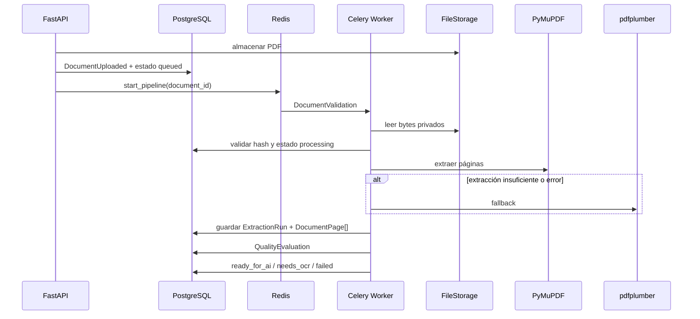

# Iteración 5: Pipeline de Extracción de Texto

## Alcance

Se implementó el primer procesamiento asíncrono de SmartQuote AI mediante Celery y Redis. El pipeline extrae texto embebido de PDFs, lo persiste por página, calcula calidad y deja cada documento listo para una etapa futura de IA o marcado para OCR.

No se implementaron IA, OCR, productos, proveedores ni RFQs.

## Capas

```text
API
└── carga y endpoints de consulta
Application
├── casos de uso de cada etapa
├── DocumentTextExtractor
├── DocumentProcessingQueue
├── ExtractionRepository
└── DocumentQualityEvaluator
Domain
├── TenderDocument y transiciones
├── DocumentPage
├── ExtractionRun
├── DocumentQuality
└── eventos
Infrastructure
├── Celery / Redis
├── PyMuPDF / pdfplumber
├── SQLAlchemy / Alembic
└── logs JSON
```

## Pipeline



## Independencia de etapas

Cada etapa es una tarea Celery nombrada e idempotente. Puede reintentarse con el UUID del documento sin iniciar el proceso en la API web.

La tarea de entrada ejecuta el orquestador dentro de un worker Celery. Las cinco etapas también permanecen registradas como tareas independientes para pruebas, reintentos operativos y evolución futura. La validación reclama la fila del documento mediante un bloqueo transaccional; una entrega duplicada se detiene antes de invocar los extractores. Un error se registra como `DocumentProcessingFailed` y deja el documento en `failed`.

## Calidad

Métricas:

- páginas procesadas;
- páginas vacías;
- caracteres;
- palabras por página;
- porcentaje vacío;
- densidad por página y agregada;
- duración total y por página.

La decisión `manual_review` se conserva como evidencia de calidad. Debido a que la máquina de estados aprobada no contiene `needs_review`, el estado operativo es `needs_ocr` con `requires_manual_review=true`.

## Idempotencia

`processing_key = SHA256(file_hash + strategy_versions + canonical_configuration)`.

La base restringe una clave por documento. Una ejecución completada se devuelve sin volver a leer ni extraer el PDF.

## Observabilidad

Los procesos web y worker emiten JSON con:

- `document_id`;
- etapa;
- extractor;
- duración;
- error;
- estado.

Las métricas históricas se obtienen de `extraction_runs`, `document_pages`, `document_qualities` y `tender_documents`.

## Riesgos y decisiones

- Celery Beat recupera documentos `uploaded` o `queued` ante fallos de publicación.
- La validación de hash se repite en el worker para detectar corrupción entre carga y procesamiento.
- No se guarda una sola cadena de texto; se conserva evidencia por página.
- Los archivos permanecen privados y los extractores reciben bytes.
- No se ejecuta OCR de forma implícita.

## Próxima iteración

Recomendaciones:

- OCR real para `needs_ocr`;
- cola separada y límites de recursos para OCR;
- outbox transaccional para publicación exactamente una vez;
- panel de métricas y alertas;
- cancelación cooperativa de tareas;
- extracción de estructura antes de IA;
- versionado explícito del esquema de prompts cuando se apruebe IA.
