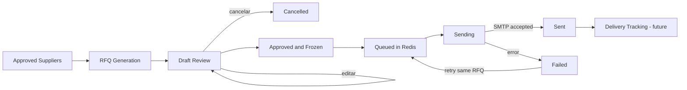

# Generación y envío de solicitudes de cotización

## Alcance

La Iteración 8 transforma proveedores aprobados y el último snapshot de catálogo aprobado en solicitudes de cotización revisables. La RFQ representa la decisión comercial; `EmailMessage` representa un intento de transporte. El dominio no conoce SMTP, Gmail API, Microsoft Graph ni credenciales.

No se implementan lectura de buzón, respuestas, análisis de cotizaciones, comparativos ni seguimiento automático de entrega.

## Arquitectura

```text
FastAPI
├── generar y listar RFQs
├── editar, aprobar y cancelar
├── solicitar envío asíncrono
└── consultar intentos y auditoría
Application
├── EmailComposer
├── TemplateRenderer
├── AttachmentProvider
├── EmailSender
├── RfqDeliveryQueue
├── RfqRepository
└── casos de uso de RFQ
Domain
├── RfqRequest
├── EmailMessage
├── EmailAttachment
├── EmailTemplate
└── OutboundMessageLog
Infrastructure
├── JinjaTemplateRenderer
├── TemplateEmailComposer
├── StoredDocumentAttachmentProvider
├── SMTPEmailSender
├── Celery / Redis
└── SQLAlchemy / Alembic
```

La sustitución de SMTP por Gmail API o Microsoft Graph requiere otro adaptador de `EmailSender`; no modifica estados, casos de uso, plantillas, adjuntos ni endpoints.

## Pipeline



El endpoint de envío no abre una conexión SMTP. Solo valida el estado, registra al usuario, cambia la RFQ a `queued` y publica su UUID en la cola `rfq-delivery`.

## Modelo de dominio

### `RfqRequest`

Conserva licitación, proveedor aprobado, snapshot de catálogo, productos, plantilla, destinatarios, asunto, cuerpo, fecha límite, observaciones, versión, aprobación, estado e idempotencia. Cada edición previa a aprobación incrementa `version`.

### `EmailMessage`

Es un intento inmutable de transporte para una versión concreta de RFQ. Conserva destinatarios, asunto, cuerpo, snapshot de adjuntos, proveedor, número de intento, estado, duración, identificador externo y errores.

Una RFQ fallida no se reemplaza por otra. Un reintento crea un nuevo `EmailMessage` vinculado a la misma RFQ, versión y clave de idempotencia.

### `EmailAttachment`

Conserva metadatos de un documento privado: UUID documental, nombre original, SHA-256, tamaño y MIME. El contenido binario se obtiene mediante `AttachmentProvider` justo antes del envío y se vuelve a validar contra esos metadatos.

### `EmailTemplate`

Describe una versión de plantilla mediante asunto y cuerpo parametrizados. La fuente está versionada en el repositorio; el HTML o texto generado no es la fuente de verdad de la plantilla.

### `OutboundMessageLog`

Registra hitos de cada intento: inicio, éxito o fallo, proveedor, timestamp y detalles no sensibles. Nunca almacena contraseñas SMTP.

## Estados y transiciones

```text
draft → pending_review → approved → queued → sending → sent → delivered
   └──────────────→ cancelled      └──────→ failed → queued
```

Reglas principales:

- solo `draft` y `pending_review` se pueden editar;
- la aprobación exige al menos un destinatario y congela contenido y adjuntos;
- una RFQ aprobada no puede cambiar destinatarios, asunto, cuerpo ni documentos;
- `sent` no puede volver a `queued`;
- `failed` puede reintentarse sobre la misma RFQ;
- `cancelled` y `delivered` son terminales;
- un estado `sending` ambiguo no se reenvía automáticamente.

## Plantillas

La plantilla inicial se encuentra en:

```text
backend/app/email_templates/rfq/v1/template.json
```

`JinjaTemplateRenderer` usa un entorno sandbox con `StrictUndefined`. Una variable faltante produce error y no genera un correo incompleto.

Variables disponibles:

- `company`: empresa, contacto, correo y teléfono;
- `supplier`: nombre y datos del proveedor;
- `contact`: nombre del contacto;
- `tender`: UUID y título de la licitación;
- `products`: nombre, descripción, cantidad, unidad y especificaciones;
- `response_deadline`;
- `observations`.

El renderer devuelve un asunto y cuerpo. El borrador resultante puede editarse antes de aprobación, pero conserva `template_name` y `template_version` para auditoría y reproducción.

## Adjuntos

`StoredDocumentAttachmentProvider` permite seleccionar todos los PDFs activos de la licitación o UUIDs específicos. Antes de generar y antes de enviar valida:

- pertenencia del documento a la licitación;
- estado disponible del documento;
- MIME `application/pdf`;
- nombre original seguro;
- tamaño individual registrado;
- límite total configurable;
- SHA-256 del contenido físico;
- coincidencia entre tamaño físico y metadatos.

El límite se configura mediante `SMARTQUOTE_MAX_EMAIL_ATTACHMENT_BYTES`, con 25 MiB por defecto.

## Envío SMTP

`SMTPEmailSender` construye un mensaje MIME estándar, agrega PDFs y usa un `Message-ID` estable:

```text
<idempotency_key@SMARTQUOTE_SMTP_MESSAGE_ID_DOMAIN>
```

También agrega:

```text
X-SmartQuote-RFQ-ID
X-SmartQuote-Idempotency-Key
```

El adaptador soporta SMTP simple, STARTTLS, SSL y autenticación. Las credenciales provienen de configuración y nunca llegan al dominio, auditoría o respuestas API.

### Frontera de consistencia

Antes de conectar con SMTP, Application confirma en PostgreSQL que la RFQ y el intento están en `sending`. Esto impide que dos workers reclamen el mismo envío.

Si SMTP devuelve un error conocido, el intento pasa a `failed` y la RFQ queda reintentable. Si el worker muere después de que SMTP acepta el mensaje pero antes de guardar el resultado, la RFQ queda en `sending`; no se reenvía automáticamente porque hacerlo podría duplicar una solicitud. Una futura etapa de seguimiento deberá reconciliar ese estado usando el identificador externo o el encabezado idempotente.

## Idempotencia

Al aprobar una versión se calcula:

```text
send_idempotency_key = SHA256(
    rfq_id
    + version
    + recipients
    + subject
    + body
    + attachment_hashes
)
```

La base de datos impone unicidad por RFQ y número de intento, y por clave idempotente del mensaje. `POST /send` rechaza RFQs ya enviadas, en envío o ya encoladas. Un reintento fallido conserva la misma RFQ y clave, pero incrementa `attempt_number`.

La generación también es idempotente. Para cada proveedor aprobado se calcula una clave con snapshot de catálogo, proveedor, plantilla, fecha límite, observaciones y adjuntos. Una solicitud idéntica reutiliza el borrador existente.

## Auditoría y eventos

Eventos registrados:

- `RfqGenerated`
- `RfqEdited`
- `RfqApproved`
- `RfqCancelled`
- `RfqQueued`
- `EmailSendingStarted`
- `EmailSent`
- `EmailFailed`
- `AttachmentGenerated`
- `TemplateRendered`
- `OutboundMessageRecorded`

La trazabilidad incluye usuario generador, editor, aprobador y solicitante del envío; destinatarios; asunto; versión; adjuntos; proveedor SMTP; timestamps; duración; resultado; identificador externo y errores sanitizados.

## Observabilidad

`GET /api/v1/tenders/{id}/rfqs` calcula:

- RFQs totales, pendientes, aprobadas, encoladas, enviadas, fallidas y canceladas;
- porcentaje de éxito;
- tamaño promedio de adjuntos;
- duración promedio del envío;
- cantidad de reintentos.

Los logs estructurados incluyen `rfq_id`, `message_id`, intento, proveedor y duración. No incluyen credenciales ni contenido binario.

## Endpoints

| Método | Ruta | Función |
|---|---|---|
| `POST` | `/api/v1/tenders/{id}/rfqs/generate` | Generar o reutilizar borradores |
| `GET` | `/api/v1/tenders/{id}/rfqs` | Listar RFQs y métricas |
| `GET` | `/api/v1/rfqs/{id}` | Consultar una RFQ |
| `PUT` | `/api/v1/rfqs/{id}` | Editar borrador, destinatarios y adjuntos |
| `POST` | `/api/v1/rfqs/{id}/approve` | Aprobar y congelar versión |
| `POST` | `/api/v1/rfqs/{id}/cancel` | Cancelar |
| `POST` | `/api/v1/rfqs/{id}/send` | Encolar envío asíncrono |
| `GET` | `/api/v1/rfqs/{id}/messages` | Intentos y logs de salida |

## Desarrollo local con Mailpit

Docker Compose incluye Mailpit como receptor SMTP de desarrollo:

```bash
docker compose up --build
```

- API: `http://localhost:8000`
- Mailpit UI: `http://localhost:8025`
- SMTP: `localhost:1025`

El worker escucha la cola RFQ:

```bash
uv run celery -A app.infrastructure.tasks.celery_app:celery_app worker \
  --loglevel=INFO \
  --queues=document-processing,ai-extraction,supplier-discovery,rfq-delivery
```

## Proveedores de correo futuros

Para Gmail API, Microsoft Graph u otro servicio se implementa `EmailSender.send()` y se configura la dependencia. El nuevo adaptador debe devolver `provider_name`, `external_message_id` y `duration_ms`, traducir errores al contrato `EmailDeliveryError` y respetar la clave idempotente. El dominio y los endpoints no cambian.
