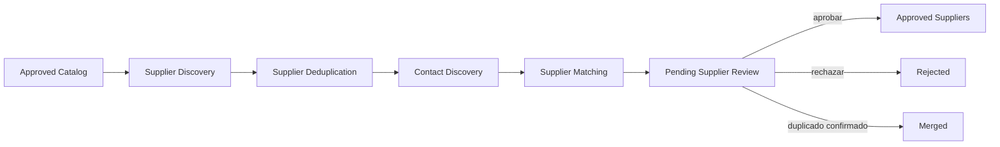

# Descubrimiento y gestión de proveedores

## Alcance

La Iteración 7 toma el último catálogo aprobado de una licitación y genera proveedores candidatos revisables. El dominio no conoce buscadores, APIs ni directorios: Application depende únicamente de `SupplierSearchService` y la primera infraestructura es `SearchProviderAdapter`.

No se implementan RFQs, envío de correo, monitoreo de respuestas ni análisis de cotizaciones.

## Arquitectura

```text
FastAPI
├── iniciar descubrimiento
├── consultar proveedores
└── editar, aprobar, rechazar, fusionar o crear manualmente
Application
├── SupplierSearchService
├── SupplierDiscoveryQueue
├── SupplierDeduplicationService
├── SupplierMatchingService
├── casos de uso por etapa
└── SupplierRepository
Domain
├── Supplier                    # maestro global
├── TenderSupplier              # asociación y estado por licitación
├── SupplierContact
├── SupplierSource
├── ProductSupplierMatch
├── SupplierDiscoveryRun
└── SupplierMergeSuggestion
Infrastructure
├── SearchProviderAdapter
│   └── JsonDirectorySearchClient
├── Celery / Redis
└── SQLAlchemy / Alembic
```

`SearchProviderAdapter` traduce resultados de una fuente intercambiable al contrato estable de Application. La implementación inicial puede leer un directorio JSON privado. Un buscador web, una API empresarial o una base interna puede sustituir el cliente sin modificar Domain, matching, revisión o API.

## Pipeline



Cada etapa también está registrada como tarea Celery independiente:

- `smartquote.suppliers.search`
- `smartquote.suppliers.deduplicate`
- `smartquote.suppliers.discover_contacts`
- `smartquote.suppliers.match`
- `smartquote.suppliers.start_review`

La tarea `smartquote.suppliers.discover` orquesta el flujo completo en la cola `supplier-discovery`. Todas las etapas comprueban el estado persistido antes de trabajar, de modo que pueden reintentarse sin repetir etapas completadas.

## Modelo y separación de responsabilidades

### `Supplier`

Es el registro maestro global. Conserva razón social, nombre comercial, sitio, dominio normalizado, categoría, ubicación y descripción. No contiene estado de revisión de una licitación.

### `TenderSupplier`

Relaciona un `Supplier` con una licitación. Conserva el run de origen, estado de revisión, usuario revisor, rechazo, creación manual y referencias de fusión. El mismo proveedor maestro puede participar en varias licitaciones con estados distintos.

### `SupplierContact`

Conserva tipo, valor, confianza, fuente, nombre y cargo. Los tipos admitidos son correo, teléfono, WhatsApp y formulario de contacto. Un dato incompleto no se inventa: se omite o se conserva como `null` según corresponda.

### `SupplierSource`

Registra proveedor de búsqueda, tipo de fuente, URL, título, extracto y fecha. Todo proveedor descubierto debe tener al menos una fuente verificable.

### `ProductSupplierMatch`

Relaciona un producto del snapshot aprobado con un proveedor maestro. Conserva score, componentes, razones y versión del algoritmo.

## Matching determinístico

`SupplierMatchingService` versión `1.0.0` produce un score reproducible de 0 a 100:

| Componente | Peso máximo | Cálculo |
|---|---:|---|
| Nombre | 35 | similitud Jaccard entre nombre de producto y razón/nombre comercial |
| Categoría | 25 | coincidencia exacta o similitud de tokens |
| Palabras clave | 20 | solapamiento entre nombre, descripción, categoría, especificaciones y perfil del proveedor |
| Especificaciones | 20 | proporción de tokens técnicos presentes en el perfil del proveedor |

Antes de comparar se aplican las mismas reglas de tokenización, minúsculas y palabras vacías. No hay llamadas a IA ni valores aleatorios. El resultado registra los cuatro componentes y una explicación textual por componente.

El score no aprueba proveedores. Solo ordena evidencia para revisión humana.

## Deduplicación

`SupplierDeduplicationService` compara:

1. dominio web normalizado;
2. correos normalizados;
3. teléfonos normalizados;
4. razón social;
5. nombre comercial.

Una identidad exacta fuerte, como el mismo dominio o correo, permite reutilizar el maestro global y agregar nuevas fuentes/contactos. No se crea un segundo maestro.

Cuando las señales son parciales, el servicio calcula una similitud entre 0 y 1. Si supera el umbral configurado pero no existe identidad exacta, se crea `SupplierMergeSuggestion`. Ningún registro se elimina o fusiona automáticamente.

La fusión aprobada por un usuario:

- conserva el proveedor objetivo;
- copia contactos, fuentes y mejores matches que falten;
- marca el proveedor origen y su asociación como `merged`;
- conserva todas las filas para auditoría;
- registra usuario, fecha, señales y evento `SupplierMerged`.

## Estados

```text
candidate → contacts_found → pending_review → approved
                                      ├──────→ rejected
                                      └──────→ merged
```

`contacts_found` significa que terminó la etapa de búsqueda de contactos, no que se haya encontrado obligatoriamente un dato. Esto permite representar correctamente proveedores con información pública incompleta sin fabricar contactos.

Los proveedores manuales se crean directamente en `pending_review`, con una fuente `manual` y auditoría `ManualSupplierCreated`.

## Idempotencia

```text
idempotency_key = SHA256(
    approved_catalog_snapshot_products
    + canonical_search_configuration
    + search_provider_name
    + search_provider_version
    + matching_algorithm_version
)
```

Una ejecución completada con la misma clave se reutiliza. Un run fallido puede reiniciarse sobre la misma fila. Cambiar catálogo, proveedor, configuración o algoritmo genera una nueva ejecución y conserva el historial anterior.

## Trazabilidad y observabilidad

`SupplierDiscoveryRun` conserva configuración, proveedor, versiones, etapa, resultados crudos, errores, duraciones y métricas. La API calcula por licitación:

- proveedores totales, pendientes, aprobados, rechazados y fusionados;
- duplicados detectados;
- porcentaje con contacto válido;
- porcentaje de aprobación;
- duración promedio de búsqueda y matching;
- errores del proveedor de búsqueda.

Los eventos registrados son:

- `SupplierDiscoveryStarted`
- `SupplierDiscovered`
- `SupplierDeduplicated`
- `SupplierContactsDiscovered`
- `SupplierMatchingCompleted`
- `SupplierApproved`
- `SupplierRejected`
- `SupplierMerged`
- `ManualSupplierCreated`

También se registra `SupplierUpdated` como regla adicional para auditar las correcciones humanas previas a aprobación.

## Endpoints

| Método | Ruta | Función |
|---|---|---|
| `POST` | `/api/v1/tenders/{id}/suppliers/discover` | Crear/reutilizar run y encolarlo |
| `GET` | `/api/v1/tenders/{id}/suppliers` | Proveedores, fuentes, contactos, matches y métricas |
| `GET` | `/api/v1/suppliers/{id}` | Detalle de una asociación de licitación |
| `PUT` | `/api/v1/suppliers/{id}` | Editar datos pendientes y contactos |
| `POST` | `/api/v1/suppliers/{id}/approve` | Aprobar |
| `POST` | `/api/v1/suppliers/{id}/reject` | Rechazar |
| `POST` | `/api/v1/suppliers/merge` | Confirmar fusión |
| `POST` | `/api/v1/suppliers/manual` | Crear proveedor manual |

En estas rutas `{id}` representa el UUID de `TenderSupplier`. La respuesta también incluye `supplier_id`, que identifica el maestro global.

## Seguridad y límites

- La API no ejecuta búsquedas en el proceso HTTP.
- Los resultados se validan antes de crear dominio.
- Las fuentes requieren URL no vacía.
- Los contactos se normalizan y validan por tipo.
- No se aceptan transiciones inválidas ni edición después de aprobación/rechazo/fusión.
- No se registran credenciales del proveedor de búsqueda.
- La fuente inicial es un directorio configurable; no se realizan búsquedas web implícitas.

## Evolución

Para integrar una fuente nueva se implementa un cliente de búsqueda y se conecta a `SearchProviderAdapter`, o se crea otro adaptador de `SupplierSearchService`. No es necesario cambiar entidades, casos de uso, matching, deduplicación ni endpoints.
